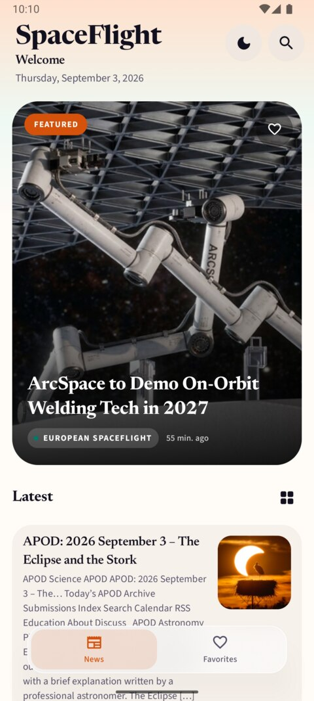
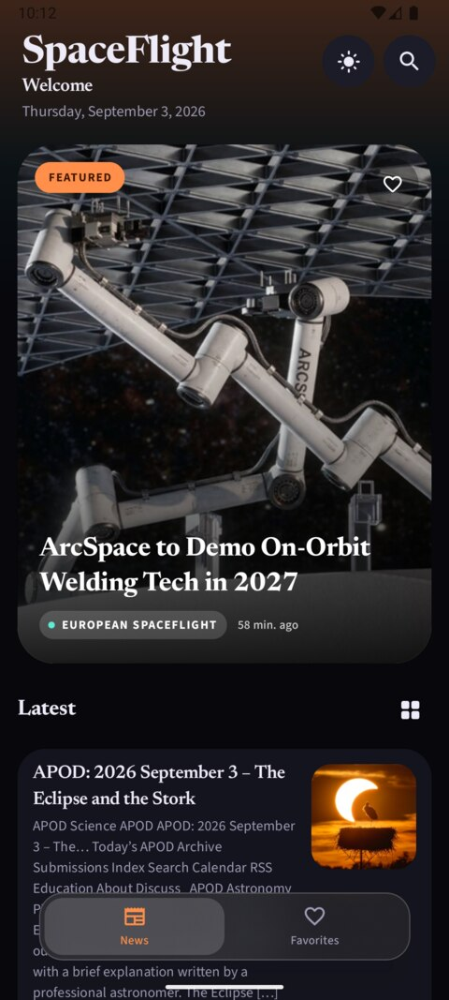
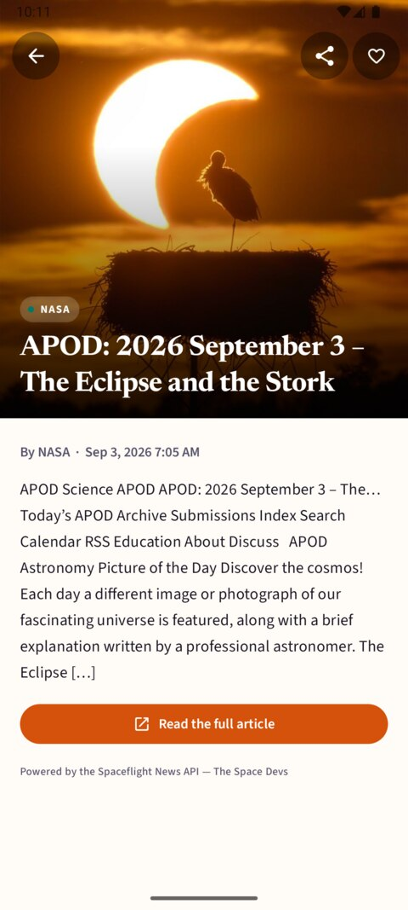
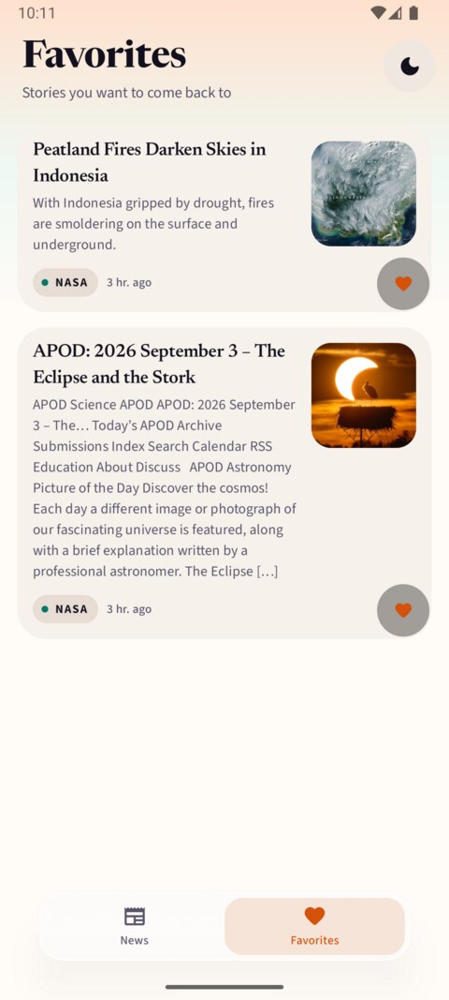
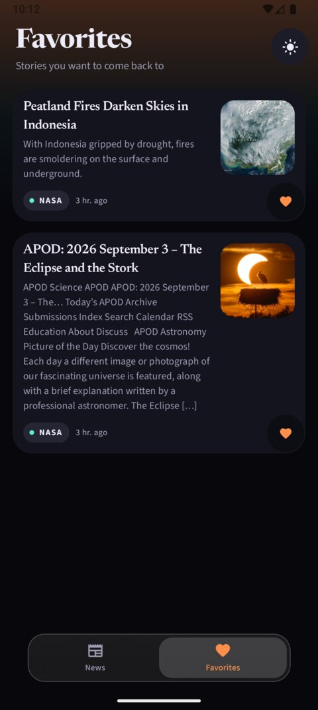
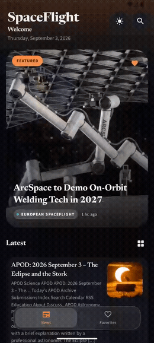
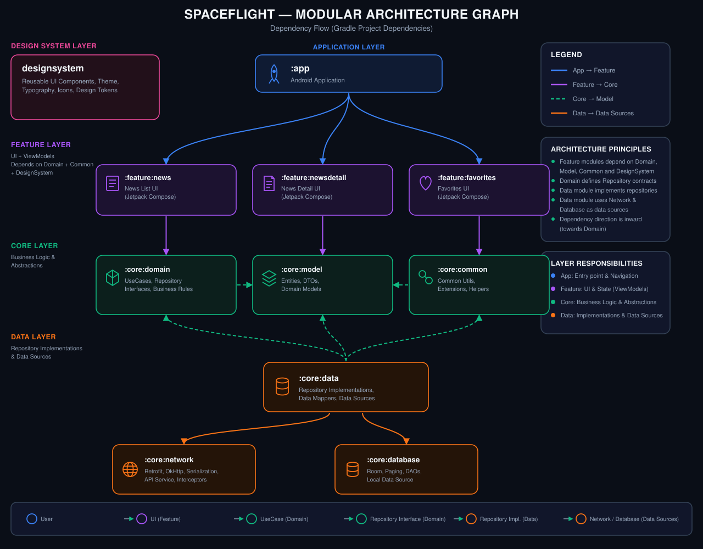

<p align="center">
  
</p>

# SpaceFlight

An offline-first Android app for browsing spaceflight news, built on the [Spaceflight News API v4](https://api.spaceflightnewsapi.net/v4/). Users can browse the latest articles, search across them, read full article detail with images, and save favorites for later — all of it still usable with no network connection once the feed has been fetched once.

## Contents

- [Features](#features)
- [Screenshots](#screenshots)
- [Demo](#demo)
- [Tech stack](#tech-stack)
- [Architecture](#architecture)
- [Module graph](#module-graph)
- [Why `designsystem` could live in its own repo](#why-designsystem-could-live-in-its-own-repo)
- [Offline-first strategy](#offline-first-strategy)
- [Networking](#networking)
- [Dependency injection](#dependency-injection)
- [Build system](#build-system)
- [CI/CD](#cicd)
- [Testing](#testing)
- [Error handling](#error-handling)
- [Localization](#localization)
- [User preferences](#user-preferences)
- [API attribution](#api-attribution)
- [Requirements & running the app](#requirements--running-the-app)
- [Possible next steps](#possible-next-steps)

## Features

- **News feed** — paginated list of the latest articles (title, summary, publication date), with a list/grid layout toggle.
- **Article detail** — full content, hero image, publication date, and a share action.
- **Search** — keyword search across articles; falls back to an offline `LIKE` query over the local cache when there is no connection.
- **Favorites** — mark/unmark any article as a favorite; a dedicated tab lists them, independent of whatever is currently paged into the feed.
- **Offline-first feed** — once fetched, the feed and any opened article detail keep working with no network at all.
- **Dark theme** — follows the system setting by default, with a manual override the user can toggle.
- **Turkish and English** localization.

## Screenshots

<table>
  <tr>
    <th>Light</th>
    <th>Dark</th>
  </tr>
  <tr>
    <td></td>
    <td></td>
  </tr>
  <tr>
    <td></td>
    <td></td>
  </tr>
  <tr>
    <td></td>
    <td></td>
  </tr>
</table>

## Demo

<p align="center">
  
</p>

The GIF above is a 10-second, reduced-quality preview so it stays small enough to render inline. The full screen recording (~65s, with audio) is at [`docs/screenshots/demo.mp4`](docs/screenshots/demo.mp4).

## Tech stack

- **Language:** Kotlin
- **UI:** Jetpack Compose (Material 3), shared-element transitions between the feed and detail screens
- **Async:** Kotlin Coroutines & Flow
- **Navigation:** Navigation Compose, type-safe routes (`@Serializable` route types, no string routes)
- **DI:** Hilt
- **Networking:** Retrofit + kotlinx.serialization (JSON), OkHttp, Chucker (debug builds only)
- **Persistence:** Room
- **Pagination:** Paging 3, with a `RemoteMediator` bridging the network and Room
- **Image loading:** Coil
- **Build:** Gradle version catalogs + custom convention plugins (`build-logic`)

## Architecture

Each feature module follows MVVM with a unidirectional data flow: a `UiState` the screen renders, a sealed `Event` type the screen sends up on user interaction, and a `Channel`-backed `Effect` for one-shot things like snackbars. `ViewModel`s expose `StateFlow<UiState>` and take a single `onEvent(event)` entry point — no per-action lambda explosion in the screen's constructor.

Below the presentation layer the app follows a fairly standard Clean Architecture split:

- **`core:model`** — plain Kotlin data classes and the `AppError` hierarchy. No Android dependency at all.
- **`core:domain`** — repository *interfaces* and use cases. Also pure Kotlin/JVM — it describes what the app can do without knowing how.
- **`core:data`** — repository *implementations*, mappers between network/database/domain models, the `RemoteMediator`, and the offline network monitor. This is where "how" lives.
- **`core:database`** / **`core:network`** — Room and Retrofit respectively, each a thin, focused module around one concern.

Feature modules (`feature:news`, `feature:favorites`, `feature:newsdetail`) never talk to `core:data`, `core:database`, or `core:network` directly — they only depend on `core:domain` (interfaces) and `core:model`. `app` is the only module that wires a concrete `core:data` implementation into the graph (via Hilt's `@Binds`), which means any feature module's data source could be swapped or mocked without touching its code.

## Module graph

<p align="center">
  
</p>

Eleven Gradle modules in total. `core:model` and `core:domain` use a dedicated `spaceflight.jvm.library` convention plugin (plain `org.jetbrains.kotlin.jvm`, no Android Gradle Plugin) since they hold no Android-specific code — this keeps them fast to compile and enforces, at the build-graph level, that domain logic can't accidentally reach for a `Context`.

## Why `designsystem` could live in its own repo

`designsystem/build.gradle.kts` has **zero `projects.*` dependencies** — only external libraries (Compose BOM, Foundation, Material 3, Coil, Haze). It doesn't import `Article`, doesn't know what "favorite" means, and doesn't reference any other module in this project. Everything in it (theme, typography, `EmptyState`, `SearchHeader`, shared-element motion helpers, `UiText`) is generic UI vocabulary that has no idea it's currently powering a news app.

That's not an accident — it's what makes it realistic to pull out into its own repository (or publish as an internal Maven artifact) if this design system ever needs to back a second app, or be maintained by a design-systems team on its own release cadence. Nothing else in this codebase would need to change beyond replacing `implementation(projects.designsystem)` with a Maven coordinate.

## Offline-first strategy

Room is the single source of truth for the feed — the UI never reads directly from the network. `ArticleRepositoryImpl.latestArticles()` wires a Paging 3 `Pager` with:

- `pagingSourceFactory = { articleDao.pagingSource() }` — the UI always pages over what's in Room.
- `remoteMediator = ArticleRemoteMediator(...)` — a Paging 3 `RemoteMediator` that fetches from the network and writes into Room; the UI never sees this directly.

`ArticleRemoteMediator.load()` handles two cases: `REFRESH` clears the `articles` table and the paging cursor (`RemoteKeyEntity`) and refills both **inside the same Room transaction**, so the cache can never end up as a mix of two different snapshots; `APPEND` continues from the stored offset and marks `endReached` once the API stops returning a `next` link. `initialize()` always requests an initial refresh — so opening the app checks for fresh articles once, then serves everything from Room until the user backgrounds/reopens it or pulls to refresh.

The feed's `PagingData` flow is built once per `NewsViewModel` and shared via `.cachedIn(viewModelScope)`, so navigating to an article and back re-subscribes to the same already-loaded pages instead of re-fetching — no matter how deep the user has scrolled.

Search behaves the same way when there's no connection: `ArticleDao.searchPagingSource()` runs a `LIKE '%query%'` query over whatever articles are already cached, so search keeps working offline (with reduced recall, since it only sees what's been paged in already).

Favorites are their own Room table (`FavoriteArticleEntity`), decoupled from the paged feed cache — a favorited article stays available even after it ages out of the feed's local cache.

## Networking

Retrofit + `kotlinx.serialization` talk to `https://api.spaceflightnewsapi.net/v4/` (`core:network`, base URL injected via `BuildConfig`). OkHttp's logging interceptor and [Chucker](https://github.com/ChuckerTeam/chucker) are wired for debug builds only (`debugImplementation` / `releaseImplementation(chucker-noop)`), so there is zero network-inspection overhead or attack surface in release builds.

## Dependency injection

Hilt throughout. Each infra module owns its own `@Module`:

- `core:network/di/NetworkModule.kt` — Retrofit, OkHttp, the API service.
- `core:database/di/DatabaseModule.kt` — the Room database and DAOs.
- `core:data/di/DataModule.kt` — `@Binds` for each domain repository interface to its `core:data` implementation.

Feature modules only ever `@Inject` interfaces from `core:domain`; they never see a concrete `core:data` class.

## Build system

Dependency versions are centralized in `gradle/libs.versions.toml` (a Gradle version catalog), with typesafe project accessors enabled (`projects.core.domain` instead of string paths). The repeated per-module Gradle setup (Android target/compile SDK, Compose, Hilt+KSP) is factored into convention plugins under `build-logic/`, applied by id (`id("spaceflight.android.library")`, `id("spaceflight.android.compose")`, `id("spaceflight.android.hilt")`) rather than copy-pasted into every `build.gradle.kts`. Bumping `compileSdk`/`minSdk`/the Java target means editing one file (`KotlinAndroid.kt`), not eleven.

## CI/CD

`.github/workflows/android-ci.yml` runs on every push and pull request targeting `main` or `development`:

1. Validates the Gradle wrapper jar hasn't been tampered with, before running anything.
2. Sets up JDK 17 (required by AGP 8.x) and the Android SDK.
3. Restores the Gradle dependency/build cache.
4. Runs `./gradlew assembleDebug testDebugUnitTest test --continue` — `assembleDebug` compiles every module (catches config/compile errors across the whole graph), `testDebugUnitTest` covers the Android modules' unit tests, and plain `test` covers `core:domain` (a JVM-only module with no Android variant). `--continue` means one broken module doesn't hide failures in the others.
5. Uploads the test reports as a build artifact so a failure can be inspected from the Actions run page without reproducing it locally.

A new push to the same branch/PR cancels any in-progress run for it (`concurrency` + `cancel-in-progress`), so force-pushes don't queue up redundant builds.

## Testing

Unit tests exist for the parts of the app where a bug would be silent and costly: ViewModels (`NewsViewModelTest`, `FavoritesViewModelTest`, `NewsDetailViewModelTest`, `ThemeViewModelTest`), the paging source and repository implementations (`SearchArticlePagingSourceTest`, `ArticleRepositoryImplTest`, `FavoriteRepositoryImplTest`), data mapping (`ArticleMapperTest`, `ConvertersTest`), and the error-handling layer (`ErrorMapperTest`, `ErrorPresentationTest`, `SafeCallTest`). Tests lean on MockK for fakes, Turbine for asserting `Flow` emissions, `kotlinx-coroutines-test` for controlling dispatchers, and `androidx.paging.testing` for driving a `PagingSource`/`RemoteMediator` without a real Activity.

## Error handling

Every failure the data layer can produce is normalized into one small `AppError` sealed hierarchy (`NoConnection`, `Timeout`, `Server`, `Serialization`, `Unknown`) via `Throwable.toAppError()` — repositories route through a `safeCall { }` helper so a new repository method can't forget to normalize its exceptions. A single function, `AppError.toUiText()`, is the *only* place that turns an error into copy the user reads, so wording for "no connection" (or anything else) can't drift between screens. `UiText` itself is a tiny, dependency-free wrapper around a localized string resource, letting a ViewModel describe user-facing text without holding a `Context`.

## Localization

English and Turkish (`androidResources.localeFilters = listOf("en", "tr")`); all user-facing strings live in `values/strings.xml` / `values-tr/strings.xml` per module.

## User preferences

Dark-theme override and feed layout (list/grid) are the two device-local settings the app remembers, both backed by a single `SharedPreferences` file (`UserPreferencesRepositoryImpl`) exposed as `Flow`s so the UI reacts live to a change without polling.

## API attribution

The article detail screen shows an attribution line (`newsdetail_attribution`) crediting the Spaceflight News API, per the API's terms of use.

## Requirements & running the app

- JDK 17
- Android Studio (current stable) or the command line
- `minSdk` 24, `targetSdk`/`compileSdk` 36

```
./gradlew assembleDebug        # build the debug APK
./gradlew testDebugUnitTest test   # run all unit tests (Android modules + core:domain)
```

No API key or `local.properties` secrets are required — the Spaceflight News API is public.

## Possible next steps

Not required by the current scope, but worth naming for anyone picking this up next:

- **Deep linking** — the app doesn't yet register any URI scheme/App Link; adding one is small given the routes are already `@Serializable` (`navDeepLink<NewsDetailRoute>(...)` on the existing `composable<NewsDetailRoute>()`).
- **Analytics** — no event tracking yet. A thin `AnalyticsLogger` interface in `core:common` (mirroring how `NetworkMonitor` is abstracted today) backed by Firebase Analytics would fit the existing DI pattern without coupling ViewModels to a specific SDK.
- **Release hardening** — `isMinifyEnabled` is currently `false` for release builds; enabling R8/ProGuard (with the existing `proguard-rules.pro` as a starting point) would reduce APK size for an actual store release.
- **Instrumented/UI tests** — current test coverage is unit-level only; Compose UI tests for the three screens would close that gap.
